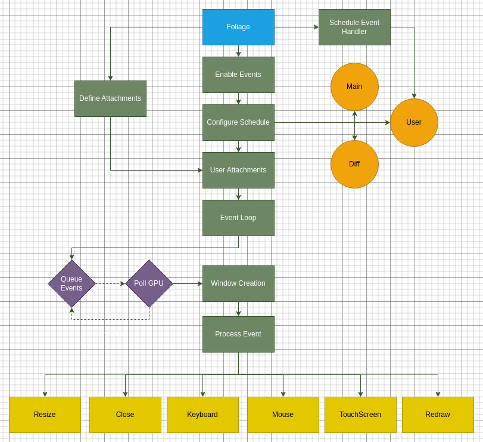
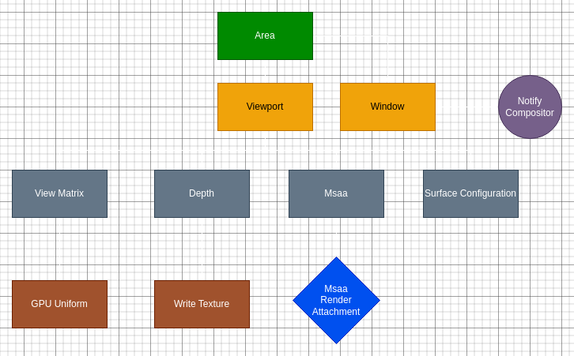
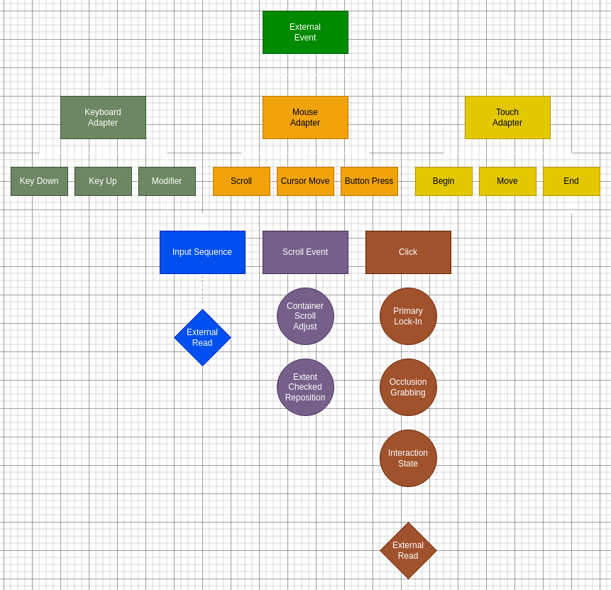
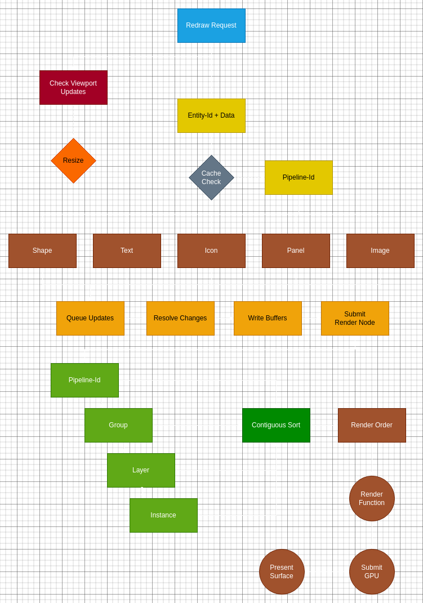

# Foliage

`Foliage` is a cross-platform UI written in `Rust`. It can target `Linux | Windows | MacOS` natively,
`Web` via `WebAssembly` and `Android` (via `cargo-ndk`). Capable of running on `iOS` but not ported
as of writing. It leverages `wgpu.rs` and `winit` for native-rendering on (almost) every platform.

## Overview

`Foliage` is the main class to interact with the library.

```rust
let mut foliage = Foliage::new();
```

Configure the class with available options

```rust
...TODO
```

then you can run the system with

```rust
// run main-loop
foliage.photosynthesize();
```

### Architecture

Here is the main overview of how the library initializes



#### Event Category

##### Resize

Resize operations



##### Input + Interaction

Overview of the interaction process



##### Redraw

Render Pipeline

