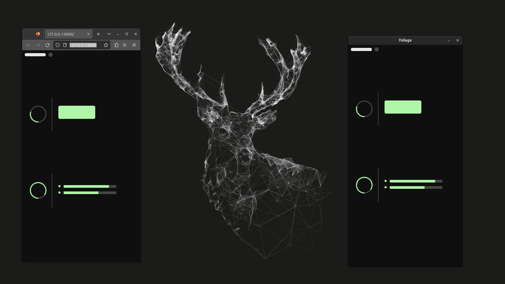

# foliage.rs

This library is a cross-platform ui with wgpu.rs and winit. It targets Desktop / Android (via ndk) / Web (via wasm).

### Website

Checkout the website | [`Website`](https://eblack-leaf.github.io/foliage) |

This is home to
- Book about the architecture
- Documentation
- Demo project



The name foliage arose from the need for a word defining a collection of 
something (aka the modules in this library). The parts are described in terms of leaves added to a pile thus 
comprising the engine architecture. When you add an attachment to the engine you
are adding a `Leaf` to the collection. Everyone loves acronyms so 
foliage could stand for 
`F-lat` `O-rthographic` `L-ogic` `I-nterface` `A-nd` `G-raphical` `E-ngine`
if need be. 


### Overview

All the objects are flat in appearance for uniform aesthetics, 
the depth is viewed orthographically, `Elm` or the `E-ntity`-`L-ogic`-`M-anager`
is responsible for spawning entities to an `ecs` and scheduling 
tasks in the `esc-schedule` to perform logic on the entities.
`Ginkgo` or the `G-raphical`-`IN-terface`-`K-ernel`...`GO` 
(not sure about the last two letters...), is responsible for interfacing
with any `gpu` resources and commands such as `wgpu::Device` and `wgpu::Queue`.
`Ash` or the `A-esthetics`-`S-ystem`-`H-andler`,
configures with the given `Renderer`s, groups them into instruction groups by
 `RenderPhase`, then executes the bundles to the surface. 
`Renderer`s are fed data from entities with `DifferentialBundle`s that compose
the data they need to `Render`. The values are cached and if different sent to `Ash` for
processing. 

`Foliage::new().with_leaf::<impl Leaf>()` is used to attach a logic module to the engine.
The `Leaf` trait must be implemented on the type calling this function.
```rust
impl Leaf for Implementor {
    fn attach(elm: &mut Elm) {
        // ...
    }
}
```
here you can attach any systems (`elm.job.main().add_systems(...)`) or spawn directly from `elm.job.container.spawn(...)`.

To attach a `Renderer` the `Render` trait must be derived.

```rust
pub trait Render
where
    Self: Sized,
{
    type Resources;
    type RenderPackage;
    const RENDER_PHASE: RenderPhase;
    fn create_resources(ginkgo: &Ginkgo) -> Self::Resources;
    fn create_package(
        ginkgo: &Ginkgo,
        resources: &mut Self::Resources,
        entity: Entity,
        render_packet: RenderPacket,
    ) -> Self::RenderPackage;
    fn on_package_removal(
        ginkgo: &Ginkgo,
        resources: &mut Self::Resources,
        entity: Entity,
        package: RenderPackage<Self>,
    );
    fn prepare_package(
        ginkgo: &Ginkgo,
        resources: &mut Self::Resources,
        entity: Entity,
        package: &mut RenderPackage<Self>,
        render_packet: RenderPacket,
    );
    fn prepare_resources(
        resources: &mut Self::Resources,
        ginkgo: &Ginkgo,
        per_renderer_record_hook: &mut bool,
    );
    fn record_behavior() -> RenderRecordBehavior<Self>;
}
```

The `Renderer` consists of `RenderPackage`s that contain per-entity information
and are used to drive the rendering. They provide a hook to the entity data
that signals that something should be drawn. When entity data has changed,
a `RenderPacket` is created from the differential data and `Serialize`d to
be sent to `Ash`. There the data can be read and processed on a `PerPackage`
rendering recording or `PerRenderer`. This determines the `RenderRecordBehavior` 
associated with this pipeline and signals the rendering structure to 
give you a `RecordInstructionRecorder` for each package, or once for the
entire pipeline. An `InstructionGroup` is made from the recordings
and set to be executed on the next call to `ash.render(...)`. `Resources`
are the per-renderer data sources that can be used to hold
the pipeline and any shared resources for rendering. `RenderPhase` consists
of two types; `Opaque` and `Alpha(priority)`. The latter allows transparent
rendering and establishes a render-order priority to correctly queue
alpha draw calls in the right order. Lower priority runs first. 

To attach a `Renderer` to the engine, call 
`Foliage::new().with_renderleaf::<impl Render + impl Leaf>()`.
The components needed to create `RenderPacket`s through a differential
must be attached with the `Leaf` implementation. Each `Renderer` enables
the types it needs differentials from by using, 
`elm.enable_differential::<T>()` for each type. A macro is provided to help
with the repetition; `differential_enable!(elm, ...)` where you list
the type-names which you want to enable differentials for.

Common rendering primitives have been established and can 
be attached by invoking for the correct implementor.

`Foliage::new().with_renderleaf::<Panel>().with_renderleaf::<Circle>()...`.

This allows the engine to only include modules for the parts you want to use.

After everything is configured you must run the `EventLoop` to poll the platform
for input / window events. Calling `Foliage::run(...)` 
will invoke this appropriately for each platform. 

    Foliage::new().with_leaf::<A>().with_renderleaf::<B>().run()

Optionally a `WindowDescriptor` can be given to configure the `Window` used 
in the engine.

```rust
Foliage::new()
        .with_window_descriptor(
            WindowDescriptor::new()
                .with_title("foliage")
                .with_desktop_dimensions((434, 840)),
        )
```

Also, if targeting android an interface must be passed in `foliage::AndroidApp`.

```rust
let android_interface = foliage::AndroidInterface::new(android_app);
// ...
Foliage::new()
        .with_window_descriptor(
            WindowDescriptor::new()
                .with_title("foliage")
                .with_desktop_dimensions((434, 840)),
        )
        .with_renderleaf::<Panel>()
        .with_renderleaf::<Circle>()
        .with_android_interface(android_interface)
        .run()
```

This can be forwarded from the android main hook described in the
environment setup guide below.

### Environment Setup Guide

### Android

#### Prerequisites

Add desired android targets

```shell
rustup target add aarch64-linux-android x86_64-linux-android
```

Must be able to compile Java on your system.

Android SDK must be installed and some tools downloaded
using the `sdkmanager`.
Get the command line tools from
[android](https://developer.android.com/studio).
Unzip the tools to your sdk root (can be wherever you want).
It refers to the `android_sdk` in the
examples below. The `sdkmanager` needs to be set up before
installing packages, here are the
[instructions](https://developer.android.com/tools/sdkmanager).
Follow steps 1 - 4.

You will need to install these tools to your SDK.

```text
sdkmanager "platform-tools" "platforms;android-<api-version>" 
    "build-tools;<version>" "ndk;<ndk-version>"
```

To run on android,

```text
run --package build_android -- <path-to-android.toml>
```

which points to a `.toml` file that describes the environment for compiling to android.

```text
package = "<package-name>"
arch = "<arch>"
ndk_home = "/path/to/android_sdk/ndk/<ndk-version>"
sdk_home = "/path/to/android_sdk/"
min_sdk = <min-api-level>
target_sdk = <target-api-level>
compile_sdk = <compile-api-level>
android_application_version = "<version>"
gradle_distribution_url = <distribution-url-id> e.g. "8.0-all"
ndk_version = "<ndk-version>"
androidx_version = "<version>"
androidx_constraintlayout_version = "<version>"
androidx_games_activity_version = "<version>"
androidx_fragment_version = "<version>"
oboe_version = "<version>"
```

`<arch>` can be `arm64-v8a` / `aarch64-linux-android`
for ARM support or
`x86_64-linux-android` for
x86 support.

You will need to configure your entry point with `foliage::AndroidApp`
as a parameter and `#[no_mangle]`
attribute.

```rust 
// android app hook
#[cfg(target_os = "android")]
#[no_mangle]
fn android_main(app: foliage::AndroidApp) {
    // call your regular main here
}
```

This will need to be compiled into a `cdylib` to generate a `.so` file for use
with the `jni` interface.

```toml
[lib]
crate-type = ["cdylib"]
```

An example of this is provided in the `entry` crate. To run
that crate, invoke `cargo run --package build_android -- entry/Android.toml`.
This will need to be setup for your environment first.
### Desktop

To run on desktop, `cargo run --package entry`

### Wasm

Wasm target must be added

```shell
rustup target add wasm32-unknown-unknown
```

To run on web, `trunk serve` in the `entry` directory

```shell
cd entry
cargo install trunk --locked
trunk serve
```