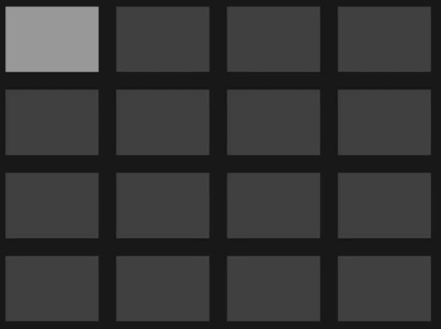

# Foliage

###### Cross Platform UI

### Grid 



```rust
handle.run_sequence(|seq| {
    seq.animate_attr(
        "shape",
        GridPlacement::new(
            2.col().to(2.col()),
            1.row().to(1.row())
        ),
        0.millis().to(500.millis()),
        Ease::DECELERATE,
    );
    seq.animate_attr(
        "shape",
        GridPlacement::new(
            2.col().to(2.col()),
            2.row().to(2.row())
        ),
        750.millis().to(1250.millis()),
        Ease::ACCELERATE,
    );
    seq.animate_attr(
        "shape",
        GridPlacement::new(
            2.col().to(4.col()),
            2.row().to(2.row())
        ),
        1500.millis().to(2000.millis()),
        Ease::ACCELERATE,
    );
    seq.animate_attr(
        "shape",
        GridPlacement::new(
            2.col().to(4.col()),
            2.row().to(4.row())
        ),
        2250.millis().to(2750.millis()),
        Ease::ACCELERATE,
    );
    seq.animate_attr(
        "shape",
        GridPlacement::new(
            1.col().to(1.col()),
            1.row().to(1.row())
        ),
        3000.millis().to(3500.millis()),
        Ease::ACCELERATE,
    );
});
```
### Shaping


```rust
handle.run_sequence(|seq| {
    seq.animate_attr(
        "shape",
        Rounding::all(1.0),
        0.millis().to(500.millis()),
        Ease::DECELERATE,
    );
    seq.animate_attr(
        "shape",
        Rounding::bottom(0.5),
        750.millis().to(1250.millis()),
        Ease::ACCELERATE,
    );
    seq.animate_attr(
        "shape",
        Rounding::top(0.5),
        1500.millis().to(2000.millis()),
        Ease::ACCELERATE,
    );
    seq.animate_attr(
        "shape",
        Rounding::all(0.5),
        2250.millis().to(2750.millis()),
        Ease::ACCELERATE,
    );
    seq.animate_attr(
        "shape",
        Rounding::all(0.0),
        3000.millis().to(3500.millis()),
        Ease::ACCELERATE,
    );
});
```