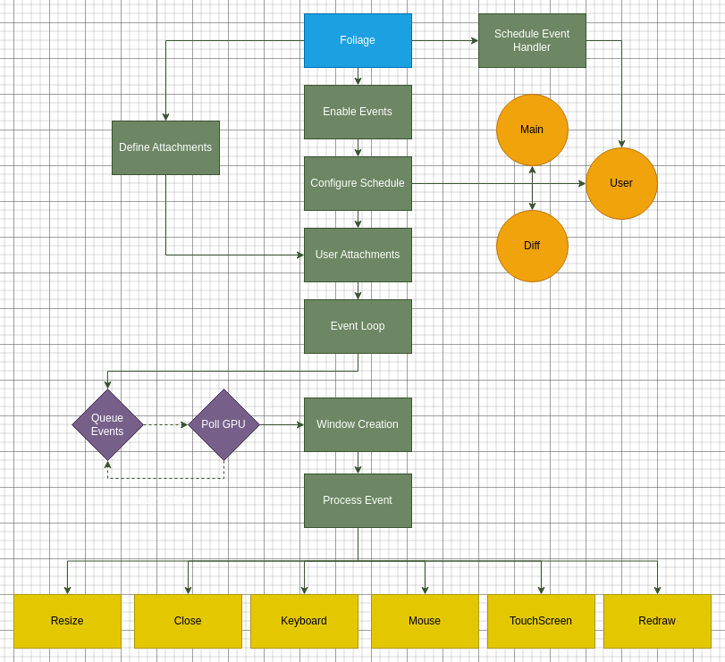
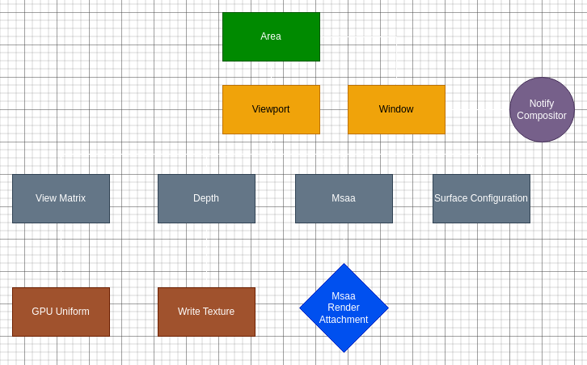
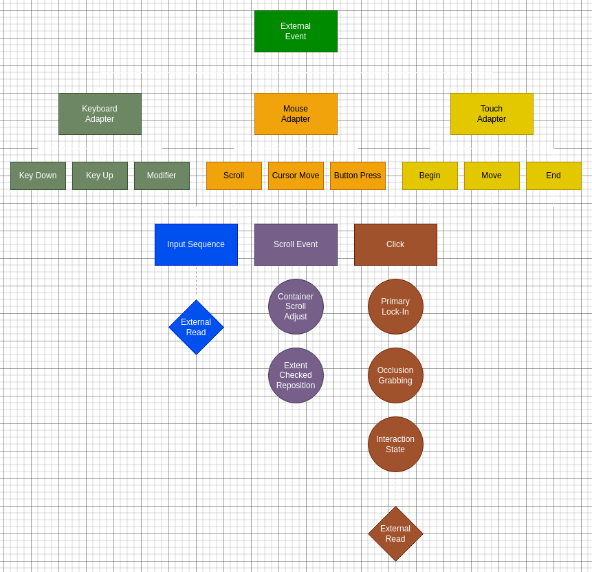
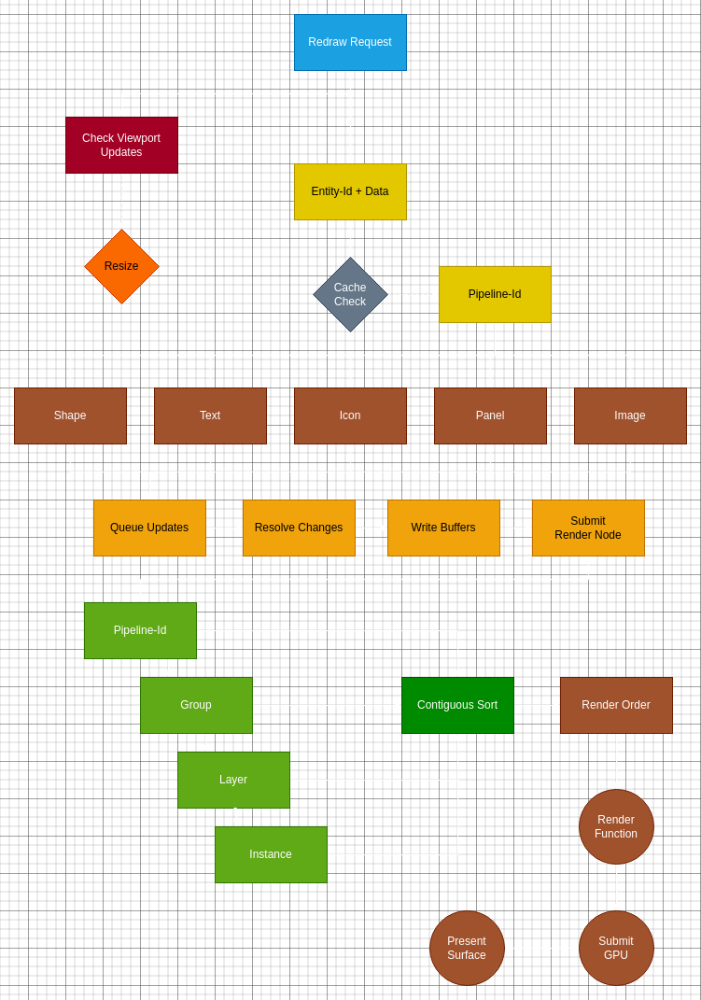

# Foliage

`Foliage` is a cross-platform UI written in `Rust`. It can target `Linux | Windows | MacOS` natively,
`Web` via `WebAssembly` and `Android` (via `cargo-ndk`). Capable of running on `iOS` but not ported
as of writing. It leverages `wgpu.rs` and `winit` for native-rendering on (almost) every platform.

## Overview

`Foliage` is the main class to interact with the library.

```rust
let mut foliage = Foliage::new();
```

Configure the class with available options

```rust
...TODO
```

then you can run the system with

```rust
// run main-loop
foliage.photosynthesize();
```

### Composites

Composites are prebuilt end-elements assembled from the rendering primitives (`Panel`, `Text`,
`Icon`, `Image`, `Shape`). Each follows the same pattern (see `Button` as the canonical
walkthrough):

1. `#[require(...)]` themed props (`Primary`/`Secondary`/`Tertiary`, `FontSize`, ...) so
   observers can rely on their presence,
2. `#[component(on_add)]` registers per-entity observers,
3. `#[component(on_insert)]` spawns child primitives (`Stem::some(root)` + `Elevation::up(n)` +
   `Root` back-pointer) and stores their entities in a `Handle`,
4. writing a prop bounces `Insert` → `Update<Prop>` → child mutation,
5. `#[component(on_discard = handle_replace::<C>)]` tears children down with the composite.

| Composite    | Data props                                | Emits |
|--------------|-------------------------------------------|-------|
| `Button`     | `TextValue`, `IconValue`, `Rounding`, `Outline` | `OnClick` (via `tree.on_click`) |
| `TextInput`  | `TextValue`, `HintText`, `LineConstraint` | `TextChanged`, `InputAction` |
| `Pagination` | `PageCount`, `Page`                       | `Selected` |
| `List`       | `ListItems`, `SelectedIndex`, `RowHeight` | `Selected` |
| `Dropdown`   | `ListItems`, `SelectedIndex`, `Expanded`  | `Selected` |
| `Prompt`     | `SuggestionProvider`, `HintText`          | `Submitted`, plus the input's events |
| `Carousel`   | `CarouselItems`, `Page`                   | `Selected` |

#### TextInput keybindings

Deterministic, monospaced, byte-offset-based editing. Default bindings
(`KeyBindings` resource; `Modifiers` matching is superset — Ctrl+Shift+C still matches Ctrl+C):

| Keys | Action |
|------|--------|
| typing / IME commit | insert (replaces selection) |
| `Enter` | submit (single-line) / newline (multiline) |
| `Backspace` / `Delete` | delete char (or active selection) |
| `Home` / `End` | line start / line end |
| `←` `→` `↑` `↓` | move cursor |
| `Shift` + arrows | extend selection |
| `Ctrl+A` | select all |
| `Ctrl+C` / `Ctrl+V` (and `Copy`/`Paste` keys) | clipboard (web paste is app-internal only) |
| `Tab` / `Escape` | no edit; forwarded as `InputAction` (Prompt: commit / dismiss suggestions) |

Input types are foliage-owned (`Key`, `PhysicalKey`, `Modifiers`) — converted once at the
`winit` boundary so no `winit` type reaches consumers.

### Architecture

Here is the main overview of how the library initializes



#### Event Category

##### Resize

Resize operations



##### Input + Interaction

Overview of the interaction process



##### Redraw

Render Pipeline

