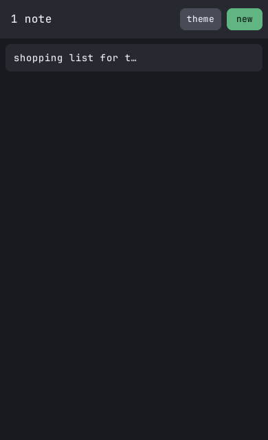

# Walkthrough: a notes app

This chapter builds one whole app from the parts the others covered: a list of notes and an editor
for them. It is about 370 lines, and every line is in the full program at the end.

- On a desk the list and the editor sit side by side. On a phone the list fills the screen, and
  opening a note replaces it with the editor, which has a way back.
- **new**, or `Ctrl+N` from anywhere, adds a note, opens it and puts the caret in it.
- A row's title follows the first line of its note as it is typed.
- **delete** fades the note's row out while the rows below slide up to close the gap.
- **theme** switches between the dark and the light scheme.




To run it, put the program in `src/main.rs` of a crate set up as in
[A first app](first-app.md#setting-up), and `cargo run`. The window opens phone-sized; drag it wider
than 600 logical pixels to see the desk layout.

## What the app holds

```rust,ignore
/// One note: its row in the list, and the area in the editor that holds what it says.
struct Note {
    ground: Leaf,
    title: Leaf,
    area: Leaf,
}

struct Notes {
    list: Leaf,
    column: Leaf,
    editor: Leaf,
    hint: Leaf,
    count: Leaf,
    new: Leaf,
    theme: Leaf,
    back: Leaf,
    delete: Leaf,
    notes: Vec<Note>,
    selected: Option<usize>,
    /// Rows fading out, and the motion that says when each is gone.
    leaving: Vec<(Leaf, Tween)>,
    dark: bool,
}
```

The app's own state is small: which notes exist, in what order, and which one is open. Everything
else lives in the tree, including what each note *says*. A `Note` is three names: the ground of
its row, the title drawn on that row, and the text area in the editor that holds its text. No
copy of the text is kept on this side, so there is nothing to keep in step with what is on screen;
when the app needs a note's text it reads it with `tap`.

The other fields are the elements `frame` asks about, plus `leaving`, the rows on their way out,
and `dark`, which scheme is in force.

## Two panes, one grid

```rust,ignore
let page = grove.plant(
    Panel::new().grid(
        Grid::new()
            .xs(1.columns(), 1.rows())
            .md(12.columns().gap(16.0), 1.rows()),
    ),
);

// The list: the whole page on a phone, the first five columns on a desk.
let list = grove.branch(
    page,
    Stem::new().at(Location::new()
        .xs(left(0.px()).right(100.pct()), top(0.px()).bottom(100.pct()))
        .md(left(1.col()).right(5.col()), top(0.px()).bottom(100.pct()))),
);
// ...
// The editor: the whole page on a phone, the other seven columns on a desk.
let editor = grove.branch(
    page,
    Stem::new().at(Location::new()
        .xs(left(0.px()).right(100.pct()), top(0.px()).bottom(100.pct()))
        .md(left(6.col()).right(12.col()), top(0.px()).bottom(100.pct()))),
);
```

The page is one column below `Md` and twelve from `Md` up, and each pane says where it sits at
both. Below 600 logical pixels both panes are the whole page; from 600 up the list takes columns 1
to 5 and the editor columns 6 to 12, with the grid's gap between them. `Lg` and `Xl` state nothing
of their own and take `md`'s placements, so the panes grow with the window.

Each pane is a `Stem`: it draws nothing, and exists to be a box the things in it are placed
against, and one element to hide, disable or dim for everything under it at once.

On a phone the two panes are in the same place, so only one of them may show. That is a decision
about *visibility*, which is not part of a placement, so the app makes it:

```rust,ignore
/// Which panes show: both on a desk, and on a phone the editor while a note is open.
fn panes(&self, grove: &mut Grove) {
    let narrow = grove.layout() < Layout::Md;
    let open = self.selected.is_some();
    grove.visible(self.list, !narrow || !open);
    grove.visible(self.editor, !narrow || open);
    grove.visible(self.back, narrow);
}
```

`panes` is called whenever the selection changes and whenever the window was resized:

```rust,ignore
if pollen.resized().is_some() {
    self.panes(grove);
}
```

A resize that crosses 600 is taken in the same frame's intake, before `frame` runs, so
`grove.layout()` is already the new breakpoint when `panes` asks. The placements need no such
call: every one is re-read against the new breakpoint by the engine.

## Parts

Three small functions build what repeats:

```rust,ignore
/// A pressable panel with a label on it, lettered in what reads on its fill.
fn button(grove: &mut Grove, under: Leaf, at: Location, fill: Palette, says: &str) -> Leaf {
    let button = grove.branch(
        under,
        Panel::new()
            .color(fill)
            .rounding(Rounding::Sm)
            .interactive()
            .at(at),
    );
    grove.branch(
        button,
        Text::new(says)
            .color(fill.on())
            .font_size(FontSize::new().xs(13))
            .intangible()
            .at(Location::new().xs(
                center_x(50.pct()).width(content()),
                center_y(50.pct()).height(content()),
            )),
    );
    button
}

/// A button's place in a header: `width` wide, its right edge `inset` from the header's.
fn tail(inset: f32, width: f32) -> Location {
    Location::new().xs(
        right(100.pct() - inset.px()).width(width.px()),
        center_y(50.pct()).height(32.px()),
    )
}
```

A button is a panel that receives, with a label on it that does not. Without `intangible` the
label would be on top of the panel wherever it has letters, and a press there would reach nothing.
`fill.on()` is the tone that reads on the button's fill, so the label is legible in either scheme
without the app choosing a color for each. `tail` places from the right: the right edge is stated
and the width runs back from it.

The third, `header`, is a `Raised` strip across the top of a pane. The list's header holds the
count of notes as its title and two buttons; the editor's holds **back** and **delete**.

The header's arithmetic has to hold at the narrowest the list gets, which is five of twelve columns
at 600 logical pixels: 240 wide. The two buttons take the right-hand 128 of that, and the title
("100 notes" is nine cells of 10 at 16 pixels) fits in what is left. That is why the list has five
columns and not four: four are 189 wide at 600, and **theme** would sit on top of the title.

## The list

Rows are placed by their index in the list:

```rust,ignore
/// Where row `n` of the list stands.
fn row_at(n: usize) -> Location {
    Location::new().xs(
        left(8.px()).right(100.pct() - 8.px()),
        top((8.0 + n as f32 * ROW).px()).height((ROW - 4.0).px()),
    )
}
```

They are grown under `column`, a `Stem` below the header that scrolls vertically. Its extent is
what its rows cover, so it starts scrolling as soon as a row runs past its bottom, with nothing to
declare about how long the list is.

Adding a note is one function, and every op in it lands in the same frame:

```rust,ignore
/// A new, empty note at the end of the list, open, and ready to type into.
fn add(&mut self, grove: &mut Grove) {
    let n = self.notes.len();
    let ground = grove.branch(
        self.column,
        Panel::new()
            .color(Palette::Raised)
            .rounding(Rounding::Sm)
            .interactive()
            .at(row_at(n)),
    );
    let title = grove.branch(
        ground,
        Text::new(title_of(""))
            .font_size(FontSize::new().xs(14))
            .intangible()
            .at(Location::new().xs(
                left(12.px()).right(100.pct() - 12.px()),
                center_y(50.pct()).height(1.letters()),
            )),
    );
    let area = grove.branch(
        self.editor,
        TextArea::new()
            .placeholder("write something")
            .font_size(FontSize::new().xs(15))
            .visible(false)
            .at(Location::new().xs(
                left(16.px()).right(100.pct() - 16.px()),
                top((HEADER + 16.0).px()).bottom(100.pct() - 16.px()),
            )),
    );
    self.notes.push(Note {
        ground,
        title,
        area,
    });
    self.select(grove, Some(n));
    grove.focus(area);
    grove.scroll(self.column, ScrollTo::show(ground));
    self.counted(grove);
}
```

Each line names things grown a few lines earlier, and all of it works on the first try because the
drain applies ops in the order they were written:

- `select` shows the new area before `focus` asks for it. Whether an element can take focus is
  answered against what has been declared as of the drain, not against last frame's resolution, so
  showing something and focusing into it in one frame is ordinary.
- `ScrollTo::show` is a destination rather than a distance. It is answered after this frame has
  placed the new row and measured the column's new extent, so the column moves by exactly as much
  as it takes to bring the row in, and not at all if it is already in view.
- The name `area` is usable the moment `branch` returns, before the area exists anywhere but the
  queue.

A title is the first line of its note with anything on it:

```rust,ignore
/// What a note is called in the list: its first line with anything on it, cut to fit a row.
fn title_of(text: &str) -> String {
    let line = text
        .lines()
        .map(str::trim)
        .find(|line| !line.is_empty())
        .unwrap_or("untitled");
    match line.chars().count() > TITLE {
        true => format!("{}…", line.chars().take(TITLE - 1).collect::<String>()),
        false => line.to_string(),
    }
}
```

`TITLE` is 20, and it is arithmetic rather than taste. Only a scrolling region clips what is in it,
so a row does not clip its title, and a title that wrapped would spill into the row below. Text is
monospaced, so twenty characters at 14 pixels are twenty cells of 9: 180 pixels. The narrowest a
title's box gets is the narrowest row, 224 pixels, less 12 on each side: 200. Twenty always fits
on one line.

## One area per note

The editor could have had a single `TextArea`, rewritten with a note's text whenever a row was
clicked. It has one per note instead, all in the same place, with only the open one visible:

```rust,ignore
/// Opens note `selected` in the editor, or nothing.
fn select(&mut self, grove: &mut Grove, selected: Option<usize>) {
    if let Some(old) = self.selected.and_then(|n| self.notes.get(n)) {
        grove.color(old.ground, Palette::Raised);
        grove.visible(old.area, false);
    }
    self.selected = selected;
    let open = selected.and_then(|n| self.notes.get(n));
    if let Some(note) = open {
        grove.color(note.ground, Palette::Raised.advance());
        grove.visible(note.area, true);
    }
    // With nothing open the editor still stands, dimmed, and takes no presses.
    grove.visible(self.hint, open.is_none());
    match open {
        Some(_) => grove.enable(self.editor),
        None => grove.disable(self.editor),
    }
    grove.opacity(self.editor, if open.is_some() { 1.0 } else { 0.5 });
    self.panes(grove);
}
```

The reason is timing. A tap is reported in the frame that takes it, but what a key does is an op:
it is queued at dispatch and applied in the drain, and `edited` reports it in the *next* frame
([Keys](input.md#keys) has the whole of it). So when someone types and then clicks another row
within one frame, the app hears the click first. With a single area, the app would answer the click
by writing the other note's text into it, and a frame later would be told the area was edited and
read back text that was no longer the typing. The typing would be filed under the wrong note, or
lost.

With an area per note, a key goes into the area that held focus when it was pressed, and `edited`
names that area, whatever has been opened since. The app cannot misfile it:

```rust,ignore
// A row's title follows the first line of its note.
for note in self.notes.iter().filter(|note| pollen.edited(note.area)) {
    if let Some(Sap::Text(text)) = grove.tap(note.area, Vein::Text) {
        grove.text(note.title, title_of(&text));
    }
}
```

The `tap` answers with what the area said at the end of the last frame, which is the frame that
applied the keys: the value on screen, as it always is.

A hidden area is not drawn and takes no input. It is still placed along with everything else, so
the price is one element per note to resolve, which is nothing at the scale of a list someone
scrolls through ([What a frame costs](../architecture/performance.md) has the numbers).

When nothing is open, the editor stays where it is on a desk but goes inert: `disable` makes it
swallow presses, so **delete** cannot be pressed with nothing to delete, and `opacity` dims it.
Both are inherited by everything under the `Stem`, so neither has to be said to the header, the
button or the hint.

## Deleting

```rust,ignore
/// Takes the open note away: its row fades and the rows below it close the gap.
fn delete(&mut self, grove: &mut Grove) {
    let Some(n) = self.selected else {
        return;
    };
    let note = self.notes.remove(n);
    grove.prune(note.area);
    let fading = grove.animate(
        note.ground,
        Motion::Opacity(0.0),
        Timing::ms(180).ease(Ease::Accelerate),
    );
    self.leaving.push((note.ground, fading));
    for (at, below) in self.notes.iter().enumerate().skip(n) {
        grove.animate(
            below.ground,
            Motion::Location(row_at(at)),
            Timing::ms(220).ease(Ease::Decelerate),
        );
    }
    // The row it pointed at is gone, so there is nothing to put back.
    self.selected = None;
    // On a desk the next note opens; on a phone, deleting goes back to the list.
    let next = match (self.notes.is_empty(), grove.layout() < Layout::Md) {
        (false, false) => Some(n.min(self.notes.len() - 1)),
        _ => None,
    };
    self.select(grove, next);
    self.counted(grove);
}
```

The note leaves the model at once, and so does its area, which is never seen again. Its row stays
in the tree while it fades, and the app keeps the motion's `Tween` so that it knows when the fade
is over:

```rust,ignore
// A row that has faded out is taken down.
self.leaving.retain(|&(ground, fading)| {
    let gone = pollen.finished(fading);
    if gone {
        grove.prune(ground);
    }
    !gone
});
```

Pruning the ground takes its title with it: a prune withers everything grown under what it names.

The rows below slide up with a `Location` motion to the place their new index gives them. The
target is written at once, and both ends of the slide are re-read every frame, so if the window
crosses a breakpoint in the middle of it, the rows still land exactly where `row_at` says. Nothing
else needs to know that a row moved: a later `add` places the next row after the last one, which
is where the list now ends.

## One chord, wherever focus is

`Ctrl+N` should add a note whether the caret is in the editor, a row was just clicked, or nothing
holds focus at all. A key goes to whatever held focus when it was pressed, or to the app itself
when nothing did, so a chord about the whole app listens in all of those places:

```rust,ignore
/// Whether a keystroke is the chord for a new note.
fn chord(stroke: &Keystroke) -> bool {
    stroke.modifiers.control && matches!(stroke.key, Key::Typed('n' | 'N'))
}
```

```rust,ignore
/// Whether the chord for a new note was pressed, wherever focus rested when it was.
fn asked(&self, pollen: &Pollen) -> bool {
    let buttons = [self.new, self.theme, self.back, self.delete];
    let notes = self.notes.iter().flat_map(|note| [note.ground, note.area]);
    let heard = buttons
        .into_iter()
        .chain(notes)
        .flat_map(|leaf| pollen.keys(leaf));
    pollen.root_keys().iter().chain(heard).any(chord)
}
```

Asking every element rather than only the one holding focus *now* matters for the same reason as
the areas: focus may have moved between the key being pressed and the frame reporting it. A field
reports every key it was sent, including ones it did nothing with, so `Ctrl+N` typed in an area
changes nothing in the note and is still heard.

Rows are among the elements asked because a tap on a row focuses it: `interactive` is what makes
an element pressable, and it is also what focus rests on. The same is what makes the list usable from the
keyboard with no code for it at all: `Tab` steps through the buttons and rows, and `activated`,
which the app asks everywhere instead of `clicked`, counts `Enter` and space on a focused row as
choosing it.

## Everything else

The rest of `frame` is one question per button:

```rust,ignore
if pollen.activated(self.new) || self.asked(&pollen) {
    self.add(grove);
}
let chosen = self
    .notes
    .iter()
    .position(|note| pollen.activated(note.ground));
if let Some(n) = chosen {
    self.select(grove, Some(n));
}
if pollen.activated(self.delete) {
    self.delete(grove);
}
if pollen.activated(self.back) {
    self.select(grove, None);
}
if pollen.activated(self.theme) {
    self.dark = !self.dark;
    grove.repaint(match self.dark {
        true => Scheme::new(),
        false => Scheme::light(),
    });
}
```

`repaint` is the whole of the theme switch. Every fill in the app is a `Palette` role, so every
element is re-read against the new scheme with nothing written to any of them.

`take_root` builds the two panes, then calls `select(grove, None)` and `counted`, so the first
frame is drawn in the same state every later "nothing open" is: the rule is stated once.

## The whole program

```rust,no_run
use foliage::{
    Area, Axes, Boxed, Divide, Ease, Foliage, FontSize, Grid, Grove, Grow, Key, Keystroke, Layout,
    Leaf, Location, Motion, Palette, Panel, Place, Pollen, Root, Rounding, Sap, Scheme, ScrollTo,
    Source, Stem, Text, TextArea, Timing, Tween, Vein, center_x, center_y, content, left, right,
    top,
};

const HEADER: f32 = 56.0;
const ROW: f32 = 44.0;
/// How many characters of a note's first line its row shows.
const TITLE: usize = 20;

/// One note: its row in the list, and the area in the editor that holds what it says.
struct Note {
    ground: Leaf,
    title: Leaf,
    area: Leaf,
}

struct Notes {
    list: Leaf,
    column: Leaf,
    editor: Leaf,
    hint: Leaf,
    count: Leaf,
    new: Leaf,
    theme: Leaf,
    back: Leaf,
    delete: Leaf,
    notes: Vec<Note>,
    selected: Option<usize>,
    /// Rows fading out, and the motion that says when each is gone.
    leaving: Vec<(Leaf, Tween)>,
    dark: bool,
}

/// Where row `n` of the list stands.
fn row_at(n: usize) -> Location {
    Location::new().xs(
        left(8.px()).right(100.pct() - 8.px()),
        top((8.0 + n as f32 * ROW).px()).height((ROW - 4.0).px()),
    )
}

/// What a note is called in the list: its first line with anything on it, cut to fit a row.
fn title_of(text: &str) -> String {
    let line = text
        .lines()
        .map(str::trim)
        .find(|line| !line.is_empty())
        .unwrap_or("untitled");
    match line.chars().count() > TITLE {
        true => format!("{}…", line.chars().take(TITLE - 1).collect::<String>()),
        false => line.to_string(),
    }
}

/// A pressable panel with a label on it, lettered in what reads on its fill.
fn button(grove: &mut Grove, under: Leaf, at: Location, fill: Palette, says: &str) -> Leaf {
    let button = grove.branch(
        under,
        Panel::new()
            .color(fill)
            .rounding(Rounding::Sm)
            .interactive()
            .at(at),
    );
    grove.branch(
        button,
        Text::new(says)
            .color(fill.on())
            .font_size(FontSize::new().xs(13))
            .intangible()
            .at(Location::new().xs(
                center_x(50.pct()).width(content()),
                center_y(50.pct()).height(content()),
            )),
    );
    button
}

/// A button's place in a header: `width` wide, its right edge `inset` from the header's.
fn tail(inset: f32, width: f32) -> Location {
    Location::new().xs(
        right(100.pct() - inset.px()).width(width.px()),
        center_y(50.pct()).height(32.px()),
    )
}

/// A raised strip across the top of a pane.
fn header(grove: &mut Grove, pane: Leaf) -> Leaf {
    grove.branch(
        pane,
        Panel::new().color(Palette::Raised).at(Location::new().xs(
            left(0.px()).right(100.pct()),
            top(0.px()).height(HEADER.px()),
        )),
    )
}

/// Whether a keystroke is the chord for a new note.
fn chord(stroke: &Keystroke) -> bool {
    stroke.modifiers.control && matches!(stroke.key, Key::Typed('n' | 'N'))
}

impl Root for Notes {
    fn take_root(grove: &mut Grove) -> Self {
        let page = grove.plant(
            Panel::new().grid(
                Grid::new()
                    .xs(1.columns(), 1.rows())
                    .md(12.columns().gap(16.0), 1.rows()),
            ),
        );

        // The list: the whole page on a phone, the first five columns on a desk.
        let list = grove.branch(
            page,
            Stem::new().at(Location::new()
                .xs(left(0.px()).right(100.pct()), top(0.px()).bottom(100.pct()))
                .md(left(1.col()).right(5.col()), top(0.px()).bottom(100.pct()))),
        );
        let bar = header(grove, list);
        let count = grove.branch(
            bar,
            Text::new("")
                .font_size(FontSize::new().xs(16))
                .intangible()
                .at(Location::new().xs(
                    left(16.px()).width(content()),
                    center_y(50.pct()).height(content()),
                )),
        );
        let theme = button(grove, bar, tail(68.0, 60.0), Palette::Muted, "theme");
        let new = button(grove, bar, tail(8.0, 52.0), Palette::Accent, "new");
        let column = grove.branch(
            list,
            Stem::new().scrolls(Axes::Vertical).at(Location::new().xs(
                left(0.px()).right(100.pct()),
                top(HEADER.px()).bottom(100.pct()),
            )),
        );

        // The editor: the whole page on a phone, the other seven columns on a desk.
        let editor = grove.branch(
            page,
            Stem::new().at(Location::new()
                .xs(left(0.px()).right(100.pct()), top(0.px()).bottom(100.pct()))
                .md(left(6.col()).right(12.col()), top(0.px()).bottom(100.pct()))),
        );
        let bar = header(grove, editor);
        let back = button(
            grove,
            bar,
            Location::new().xs(
                left(8.px()).width(64.px()),
                center_y(50.pct()).height(32.px()),
            ),
            Palette::Muted,
            "back",
        );
        let delete = button(grove, bar, tail(8.0, 72.0), Palette::Danger, "delete");
        let hint = grove.branch(
            editor,
            Text::new("nothing open")
                .font_size(FontSize::new().xs(14))
                .at(Location::new().xs(
                    center_x(50.pct()).width(content()),
                    center_y(50.pct()).height(content()),
                )),
        );

        let mut notes = Notes {
            list,
            column,
            editor,
            hint,
            count,
            new,
            theme,
            back,
            delete,
            notes: Vec::new(),
            selected: None,
            leaving: Vec::new(),
            dark: true,
        };
        notes.select(grove, None);
        notes.counted(grove);
        notes
    }

    fn frame(&mut self, grove: &mut Grove, pollen: Pollen) {
        // A row's title follows the first line of its note.
        for note in self.notes.iter().filter(|note| pollen.edited(note.area)) {
            if let Some(Sap::Text(text)) = grove.tap(note.area, Vein::Text) {
                grove.text(note.title, title_of(&text));
            }
        }
        if pollen.activated(self.new) || self.asked(&pollen) {
            self.add(grove);
        }
        let chosen = self
            .notes
            .iter()
            .position(|note| pollen.activated(note.ground));
        if let Some(n) = chosen {
            self.select(grove, Some(n));
        }
        if pollen.activated(self.delete) {
            self.delete(grove);
        }
        if pollen.activated(self.back) {
            self.select(grove, None);
        }
        if pollen.activated(self.theme) {
            self.dark = !self.dark;
            grove.repaint(match self.dark {
                true => Scheme::new(),
                false => Scheme::light(),
            });
        }
        if pollen.resized().is_some() {
            self.panes(grove);
        }
        // A row that has faded out is taken down.
        self.leaving.retain(|&(ground, fading)| {
            let gone = pollen.finished(fading);
            if gone {
                grove.prune(ground);
            }
            !gone
        });
    }
}

impl Notes {
    /// A new, empty note at the end of the list, open, and ready to type into.
    fn add(&mut self, grove: &mut Grove) {
        let n = self.notes.len();
        let ground = grove.branch(
            self.column,
            Panel::new()
                .color(Palette::Raised)
                .rounding(Rounding::Sm)
                .interactive()
                .at(row_at(n)),
        );
        let title = grove.branch(
            ground,
            Text::new(title_of(""))
                .font_size(FontSize::new().xs(14))
                .intangible()
                .at(Location::new().xs(
                    left(12.px()).right(100.pct() - 12.px()),
                    center_y(50.pct()).height(1.letters()),
                )),
        );
        let area = grove.branch(
            self.editor,
            TextArea::new()
                .placeholder("write something")
                .font_size(FontSize::new().xs(15))
                .visible(false)
                .at(Location::new().xs(
                    left(16.px()).right(100.pct() - 16.px()),
                    top((HEADER + 16.0).px()).bottom(100.pct() - 16.px()),
                )),
        );
        self.notes.push(Note {
            ground,
            title,
            area,
        });
        self.select(grove, Some(n));
        grove.focus(area);
        grove.scroll(self.column, ScrollTo::show(ground));
        self.counted(grove);
    }

    /// Opens note `selected` in the editor, or nothing.
    fn select(&mut self, grove: &mut Grove, selected: Option<usize>) {
        if let Some(old) = self.selected.and_then(|n| self.notes.get(n)) {
            grove.color(old.ground, Palette::Raised);
            grove.visible(old.area, false);
        }
        self.selected = selected;
        let open = selected.and_then(|n| self.notes.get(n));
        if let Some(note) = open {
            grove.color(note.ground, Palette::Raised.advance());
            grove.visible(note.area, true);
        }
        // With nothing open the editor still stands, dimmed, and takes no presses.
        grove.visible(self.hint, open.is_none());
        match open {
            Some(_) => grove.enable(self.editor),
            None => grove.disable(self.editor),
        }
        grove.opacity(self.editor, if open.is_some() { 1.0 } else { 0.5 });
        self.panes(grove);
    }

    /// Takes the open note away: its row fades and the rows below it close the gap.
    fn delete(&mut self, grove: &mut Grove) {
        let Some(n) = self.selected else {
            return;
        };
        let note = self.notes.remove(n);
        grove.prune(note.area);
        let fading = grove.animate(
            note.ground,
            Motion::Opacity(0.0),
            Timing::ms(180).ease(Ease::Accelerate),
        );
        self.leaving.push((note.ground, fading));
        for (at, below) in self.notes.iter().enumerate().skip(n) {
            grove.animate(
                below.ground,
                Motion::Location(row_at(at)),
                Timing::ms(220).ease(Ease::Decelerate),
            );
        }
        // The row it pointed at is gone, so there is nothing to put back.
        self.selected = None;
        // On a desk the next note opens; on a phone, deleting goes back to the list.
        let next = match (self.notes.is_empty(), grove.layout() < Layout::Md) {
            (false, false) => Some(n.min(self.notes.len() - 1)),
            _ => None,
        };
        self.select(grove, next);
        self.counted(grove);
    }

    /// Which panes show: both on a desk, and on a phone the editor while a note is open.
    fn panes(&self, grove: &mut Grove) {
        let narrow = grove.layout() < Layout::Md;
        let open = self.selected.is_some();
        grove.visible(self.list, !narrow || !open);
        grove.visible(self.editor, !narrow || open);
        grove.visible(self.back, narrow);
    }

    /// The list's title, which is how many notes there are.
    fn counted(&self, grove: &mut Grove) {
        let says = match self.notes.len() {
            0 => "no notes".to_string(),
            1 => "1 note".to_string(),
            n => format!("{n} notes"),
        };
        grove.text(self.count, says);
    }

    /// Whether the chord for a new note was pressed, wherever focus rested when it was.
    fn asked(&self, pollen: &Pollen) -> bool {
        let buttons = [self.new, self.theme, self.back, self.delete];
        let notes = self.notes.iter().flat_map(|note| [note.ground, note.area]);
        let heard = buttons
            .into_iter()
            .chain(notes)
            .flat_map(|leaf| pollen.keys(leaf));
        pollen.root_keys().iter().chain(heard).any(chord)
    }
}

fn main() {
    let mut foliage = Foliage::new();
    foliage.title("notes");
    foliage.app_id("notes");
    foliage.desktop_size(Area::new(390.0, 640.0));
    foliage.root::<Notes>();
    foliage.photosynthesize();
}
```

## Where to take it

Each of these is a small change, and each exercises a chapter:

- **Keep the notes.** Read every area's text with `tap` when the app closes or on a timer, and
  write it to a file; read the file back in `take_root` and grow a note for each entry.
  [Work off the frame](off-frame.md) covers doing the writing on a worker.
- **Search.** A `TextInput` in the list's header, and on `edited` hide the rows whose note does not
  match and re-place the rest with `row_at`, as [Text fields](fields.md) does with its filter.
- **Reorder by dragging.** Give rows `drags(Axes::Vertical)`, follow `pollen.dragged(row)`, and on
  `landed` move the note in the `Vec` and animate every row to its new index.
  [Input and focus](input.md) has the drag.
- **Split it up.** The list and the editor are each a struct with a `frame` of their own, and
  [Composing parts](components.md) shows the shape.
